# Github-Actions-For-CICD

## Steps

* Github Setup
    * Fork git repo
    * SSH Login
    * Integrate with VScode
* Test code
    * Workflow & Job
    * Maven & Checkstyle
    * Sonar Scanner
    * Sonar Cloud
* Build & Upload Image
    * Job in workflow
    * Build Docker Image
    * Upload to AWS ECR
* Deploy to ECS
    * Job in workflow
    * Deploy ECS Task def
    * RDS for app container

## Github Setup
### On the local machine go to .ssh and generate the ssh key
` cd ~/.ssh`
`ssh-keygen`

### Next step is to fork the repository (hprofile) and run the following command on your local machine

`export GIT_SSH_COMMAND="ssh -i ~/.ssh/apena001"`

### make a directory
`mkdir ~/OneDrive/desktop/actions`
`cd OneDrive/desktop/actions`
### we clone the fork repository into the action directory we created

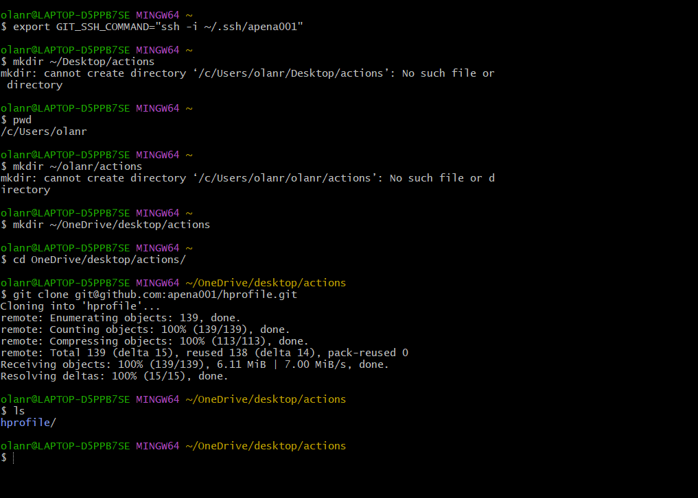

### Next we unset the below variable to enables access any other git repository

`unset GIT_SSH_COMMAND`

### And we will run a command which will inject our key information in this repository, so whenever we make any change from this repository it will use our ssh keys
` git config core.sshCommand "ssh -i ~/.ssh/apena001 -F /dev/null"` 

### To validate we use command

`cat .git/config`

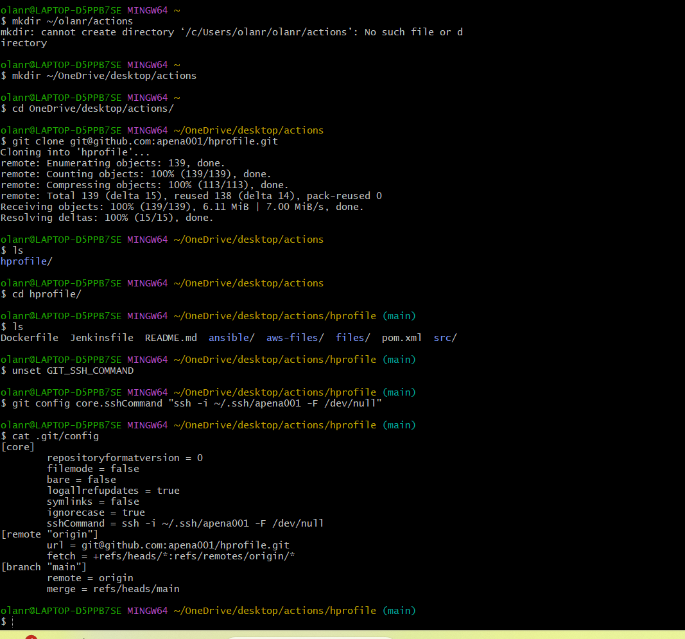

### We now set the username and email address of the user, which will make all the commits

`git config user.name apena001`
`git config user.email olanrewaju.sofela@gmail.com`

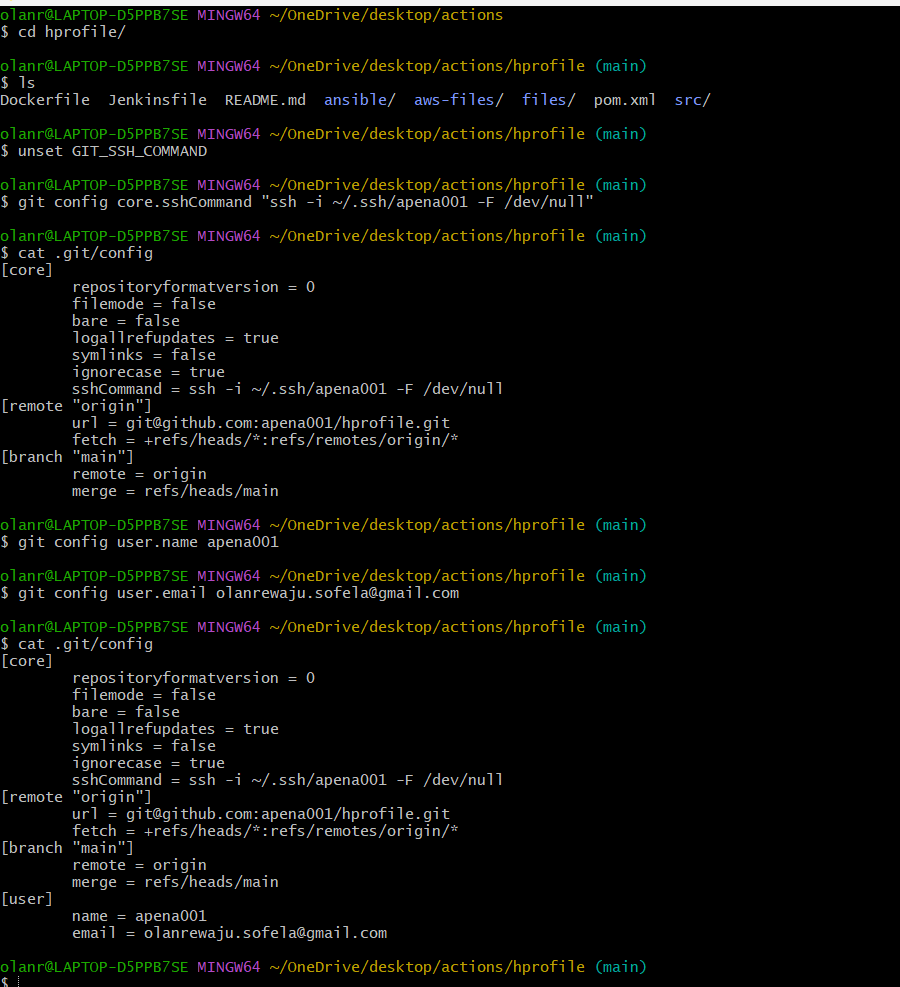

### Go to readme file change somthing save, commit and push and also check on github repository if any changes occured

## Overview of GithubActions

### we will go to out fork repository, and on click on Action tab and "set a workflow yourself" and input the following

`name: Hprofile Actions
on: workflow_dispatch
jobs:
  Testing: 
    runs-on: ubuntu-latest
    steps:
      - name: Testing Workflow
        run: echo "Workflow works!"`

### Commit changes and go to the Action on the git repository to validate and also check validate on the Vscode

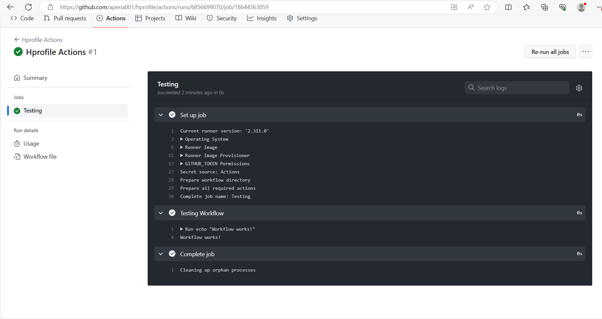

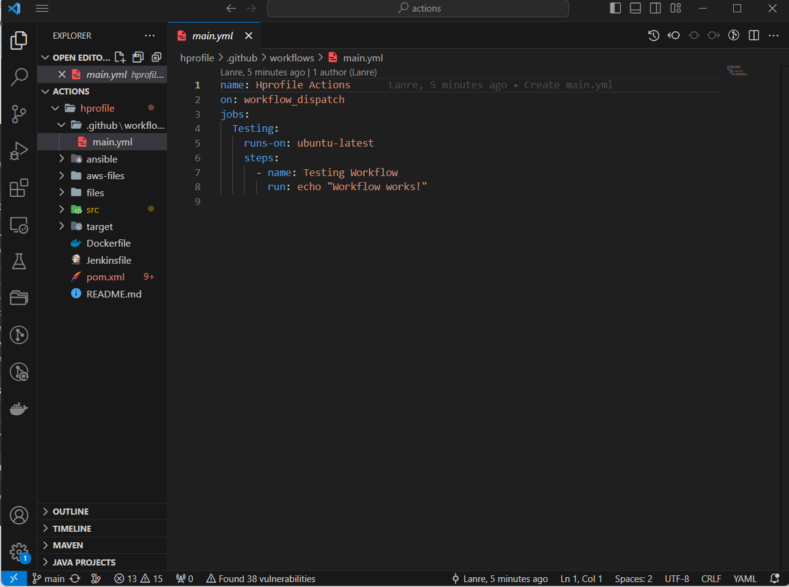

## Code Testing job in workflow

### We write our maven test command, Maven Checkstyle and scan our source code to sonar cubr scanner

`name: Hprofile Actions
 on: workflow_dispatch
 jobs:
  Testing:
    runs-on: ubuntu-latest
    steps:
      - name: Code checkout
        uses: actions/checkout@v4

      - name: Maven test
        run: mvn test

      - name: Checkstyle
        run: mvn checkstyle:checkstyle`

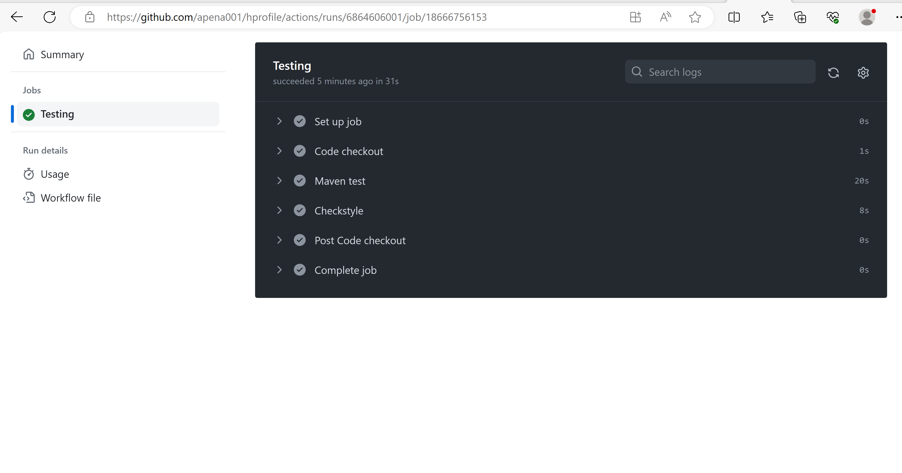

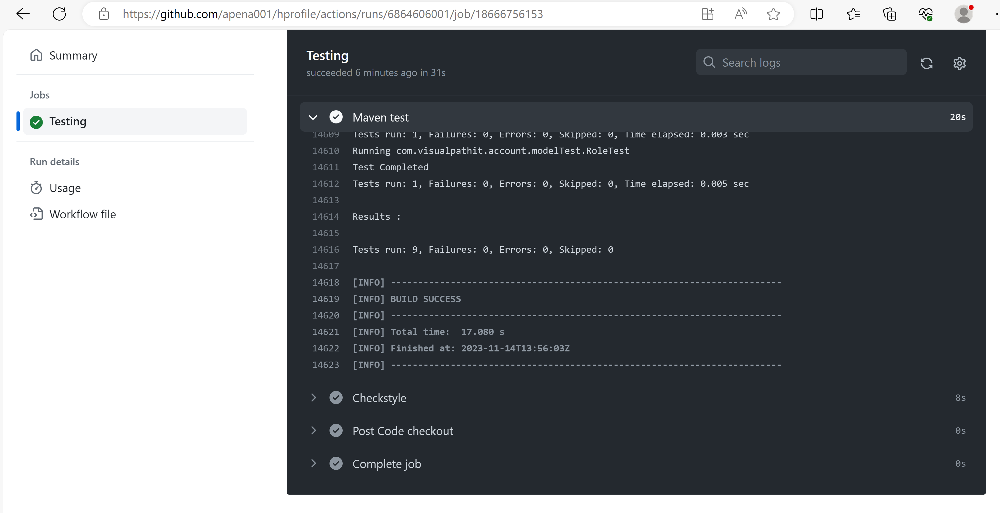

## Sonar Code Analysis

### login to SonarCloud and create an organization, we generate a token from the sonarcloud and store it on Serect and variable on our hprofile repository of our github

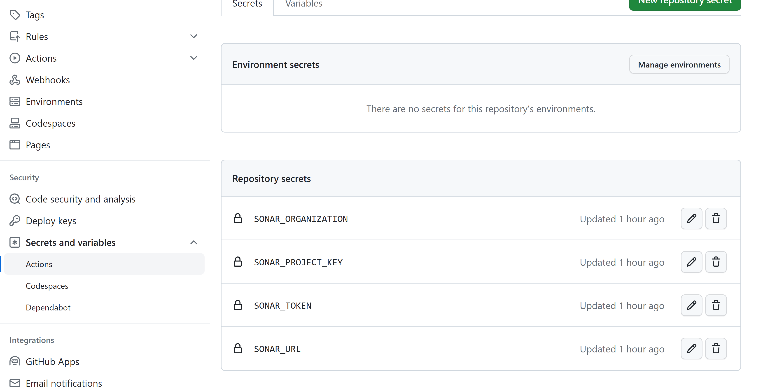

`name: Hprofile Actions
 on: workflow_dispatch
 jobs:
  Testing:
    runs-on: ubuntu-latest
    steps:
      - name: Code checkout
        uses: actions/checkout@v4

      - name: Maven test
        run: mvn test

      - name: Checkstyle
        run: mvn checkstyle:checkstyle

      # Setup java 11 to be default (sonar-scanner requirement as of 5.x)
      - name: Set Java 11
        uses: actions/setup-java@v3
        with:
         distribution: 'temurin' # See 'Supported distributions' for available options
         java-version: '11'

    # Setup sonar-scanner
      - name: Setup SonarQube
        uses: warchant/setup-sonar-scanner@v7
   
    # Run sonar-scanner
      - name: SonarQube Scan
        run: sonar-scanner
           -Dsonar.host.url=${{ secrets.SONAR_URL }}
           -Dsonar.login=${{ secrets.SONAR_TOKEN }}
           -Dsonar.organization=${{ secrets.SONAR_ORGANIZATION }}
           -Dsonar.projectKey=${{ secrets.SONAR_PROJECT_KEY }}
           -Dsonar.sources=src/
           -Dsonar.junit.reportsPath=target/surefire-reports/ 
           -Dsonar.jacoco.reportsPath=target/jacoco.exec 
           -Dsonar.java.checkstyle.reportPaths=target/checkstyle-result.xml
           -Dsonar.java.binaries=target/test-classes/com/visualpathit/account/controllerTest/`

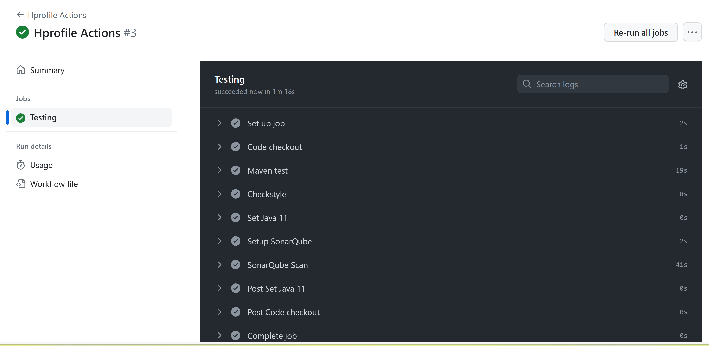

### validating on sonarcloud, we will see that the Quality Gate is showing Not Computed

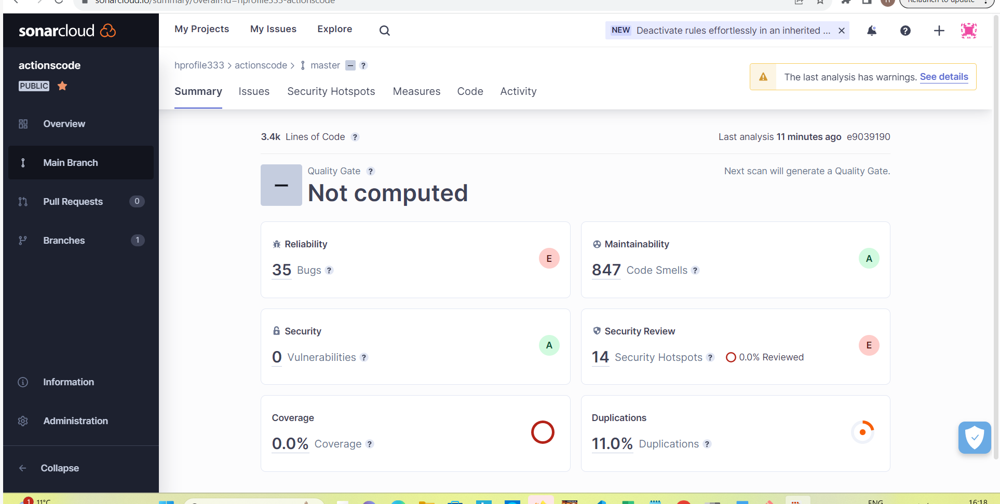

## Code Quality Gate

### We will create a sample quality gate and  will run the job again and purposely make the quality gate fails making the bugs less than 35

### In marketplace action I searched for sonar quality gate and copy and paste the code for checking the quality gate status into the main.yaml

`# Check the Quality Gate status.
      - name: SonarQube Quality Gate check
        id: sonarqube-quality-gate-check
        uses: sonarsource/sonarqube-quality-gate-action@master
        # Force to fail step after specific time.
        timeout-minutes: 5
        env:
          SONAR_TOKEN: ${{ secrets.SONAR_TOKEN }}
          SONAR_HOST_URL: ${{ secrets.SONAR_URL }} #OPTIONAL`

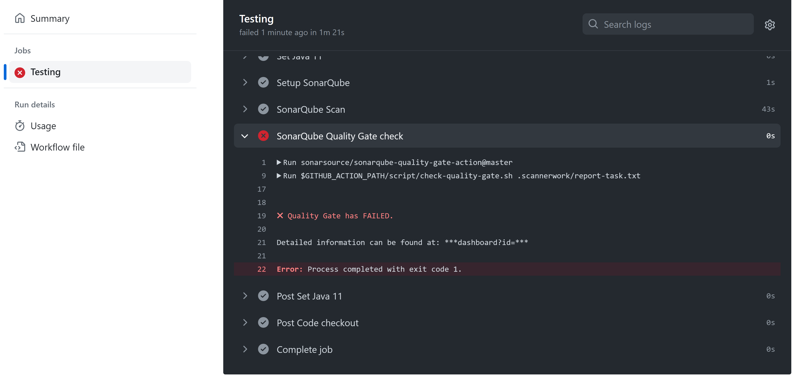

### Because we set the bugs in the Quality Gate to 30 instead of 35 that was why it fail(We purposely make it fail). Reruning and setting the bugs in the Quality Gate back to 35 bugs eventually make the Quality Gate to Pass

 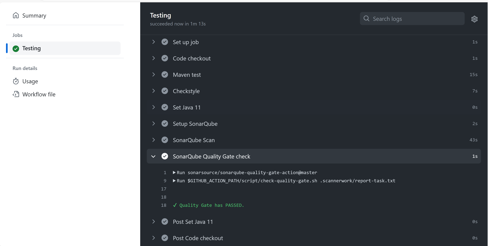   

 ## AWS IAM, ECR & RDS

 ### We will build docker image from our source code and upload it to Amazon ECR, first we will create IAM user to generate the access key and secret key and save it on github secrets and variables

 ### We will go to the Elastic Container Registry to create repository, and also create RDS for our database, after that we will lunch Ec2 instance which we will use to initialize the RDS, on the EC2 instance, we will run myqsl command and deploy the schemas

 `ls src/main/resources/db_backup.sql`

   
 ` mysql -h vproapp-actions.ckabsif0pmib.us-east-1.rds.amazonaws.com -u admin -pOd1XXXXXXXXXXXXXX accounts < src/main/resources/db_backup.sql`

  ` mysql -h vproapp-actions.ckabsif0pmib.us-east-1.rds.amazonaws.com -u admin -pOd1XXXXXXXXXXX accounts`
  
  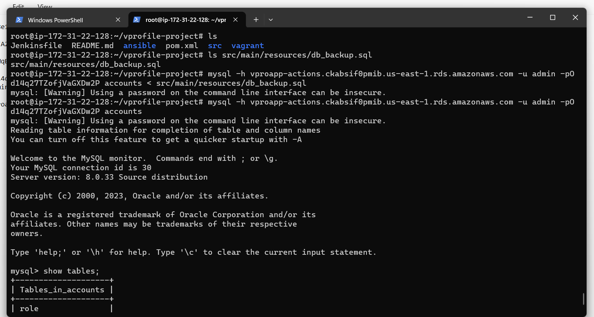

  ### We will now store all the access keys in the secret and variable in github!
  
  [Alt text](images/RDSSSS.png)

  ## Doker Build & Publish to ECR
  
  ### We are going to set up a job to build the Docker image and store it on AWS ECR

  ### updating the main.yaml file with the following

  `name: Hprofile Actions
on: workflow_dispatch
env:
  AWS_REGION: us-east-1
jobs:
  Testing:
    runs-on: ubuntu-latest
    steps:
      - name: Code checkout
        uses: actions/checkout@v4

      - name: Maven test
        run: mvn test

      - name: Checkstyle
        run: mvn checkstyle:checkstyle

      # Setup java 11 to be default (sonar-scanner requirement as of 5.x)
      - name: Set Java 11
        uses: actions/setup-java@v3
        with:
         distribution: 'temurin' # See 'Supported distributions' for available options
         java-version: '11'

    # Setup sonar-scanner
      - name: Setup SonarQube
        uses: warchant/setup-sonar-scanner@v7
   
    # Run sonar-scanner
      - name: SonarQube Scan
        run: sonar-scanner
           -Dsonar.host.url=${{ secrets.SONAR_URL }}
           -Dsonar.login=${{ secrets.SONAR_TOKEN }}
           -Dsonar.organization=${{ secrets.SONAR_ORGANIZATION }}
           -Dsonar.projectKey=${{ secrets.SONAR_PROJECT_KEY }}
           -Dsonar.sources=src/
           -Dsonar.junit.reportsPath=target/surefire-reports/ 
           -Dsonar.jacoco.reportsPath=target/jacoco.exec 
           -Dsonar.java.checkstyle.reportPaths=target/checkstyle-result.xml
           -Dsonar.java.binaries=target/test-classes/com/visualpathit/account/controllerTest/

      # Check the Quality Gate status.
      - name: SonarQube Quality Gate check
        id: sonarqube-quality-gate-check
        uses: sonarsource/sonarqube-quality-gate-action@master
        # Force to fail step after specific time.
        timeout-minutes: 5
        env:
          SONAR_TOKEN: ${{ secrets.SONAR_TOKEN }}
          SONAR_HOST_URL: ${{ secrets.SONAR_URL }} #OPTIONAL   

  BUILD_AND_PUBLISH:
    needs: Testing
    runs-on: ubuntu-latest
    steps:
      - name: Code checkout
        uses: actions/checkout@v4

      - name: Update application.properties file
        run: |
          sed -i "s/^jdbc.username.*$/jdbc.username\=${{ secrets.RDS_USER }}/" src/main/resources/application.properties
          sed -i "s/^jdbc.password.*$/jdbc.password\=${{ secrets.RDS_PASS }}/" src/main/resources/application.properties
          sed -i "s/db01/${{ secrets.RDS_ENDPOINT }}/" src/main/resources/application.properties

      - name: Build & Upload image to ECR
        uses: appleboy/docker-ecr-action@master
        with:
         access_key: ${{ secrets.AWS_ACCESS_KEY_ID }}
         secret_key: ${{ secrets.AWS_SECRET_ACCESS_KEY }}
         registry: ${{ secrets.REGISTRY }}
         repo: actapp
         region: ${{ env.AWS_REGION }}
         tags: latest,${{ github.run_number }}
         daemon_off: false
         dockerfile: ./Dockerfile
         context: ./`

  ### Validating the workflow on Actions in github and in Amazon Elastic Container Registry ECR   

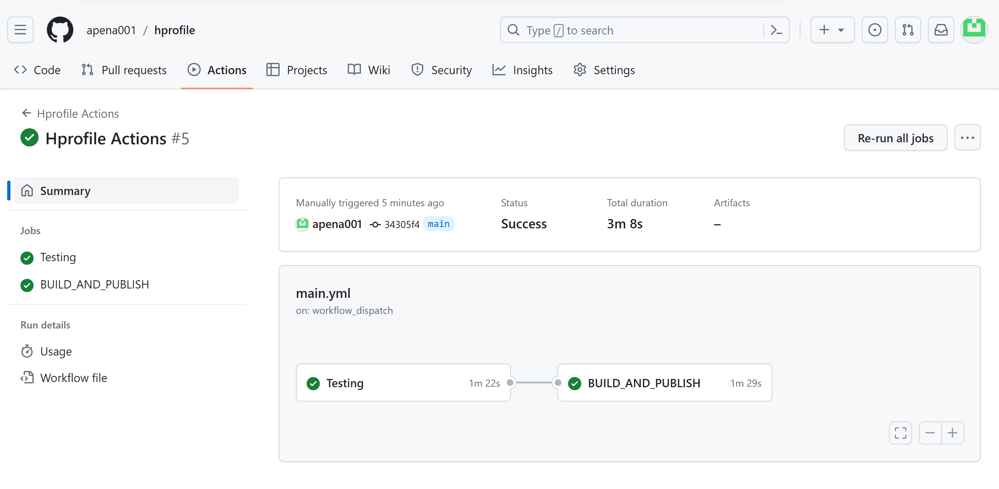

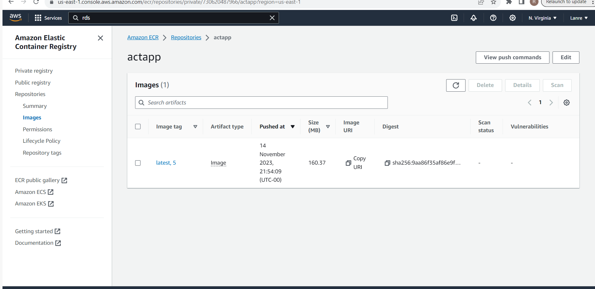

## ECS Cluster Setup

### We will use Elastic Container Service to run our container, We will create cluster and Task defination, copy the DNS name from the load balancer for validation allowing the service security group

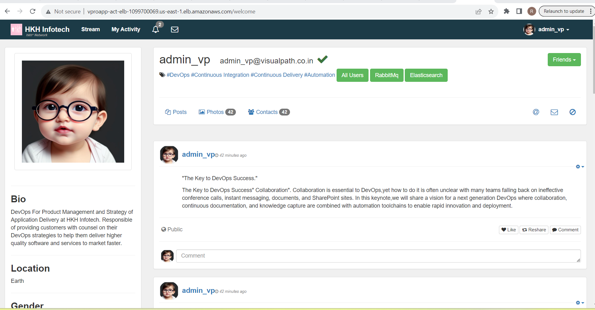

## Deploy

### We will deploy the ECS task defination in Json format in our source code and in the job, we will update the task definition to the new tag and push this new task defination to ECS service, ECS service will detect that and make changes

`name: Hprofile Actions
on: workflow_dispatch
env:
  AWS_REGION: us-east-1
  ECR_REPOSITORY: actapp
  ECR_SERVICE: vproapp-act-svc
  ECR_CLUSTER: vproapp-actions
  ECS_TASK_DEFINITION: aws-files/taskdeffile.json
  CONTAINER_NAME: vproapp
  

jobs:
  Testing:
    runs-on: ubuntu-latest
    steps:
      - name: Code checkout
        uses: actions/checkout@v4

      - name: Maven test
        run: mvn test

      - name: Checkstyle
        run: mvn checkstyle:checkstyle

      # Setup java 11 to be default (sonar-scanner requirement as of 5.x)
      - name: Set Java 11
        uses: actions/setup-java@v3
        with:
         distribution: 'temurin' # See 'Supported distributions' for available options
         java-version: '11'

    # Setup sonar-scanner
      - name: Setup SonarQube
        uses: warchant/setup-sonar-scanner@v7
   
    # Run sonar-scanner
      - name: SonarQube Scan
        run: sonar-scanner
           -Dsonar.host.url=${{ secrets.SONAR_URL }}
           -Dsonar.login=${{ secrets.SONAR_TOKEN }}
           -Dsonar.organization=${{ secrets.SONAR_ORGANIZATION }}
           -Dsonar.projectKey=${{ secrets.SONAR_PROJECT_KEY }}
           -Dsonar.sources=src/
           -Dsonar.junit.reportsPath=target/surefire-reports/ 
           -Dsonar.jacoco.reportsPath=target/jacoco.exec 
           -Dsonar.java.checkstyle.reportPaths=target/checkstyle-result.xml
           -Dsonar.java.binaries=target/test-classes/com/visualpathit/account/controllerTest/

      # Check the Quality Gate status.
      - name: SonarQube Quality Gate check
        id: sonarqube-quality-gate-check
        uses: sonarsource/sonarqube-quality-gate-action@master
        # Force to fail step after specific time.
        timeout-minutes: 5
        env:
          SONAR_TOKEN: ${{ secrets.SONAR_TOKEN }}
          SONAR_HOST_URL: ${{ secrets.SONAR_URL }} #OPTIONAL   

  BUILD_AND_PUBLISH:
    needs: Testing
    runs-on: ubuntu-latest
    steps:
      - name: Code checkout
        uses: actions/checkout@v4

      - name: Update application.properties file
        run: |
          sed -i "s/^jdbc.username.*$/jdbc.username\=${{ secrets.RDS_USER }}/" src/main/resources/application.properties
          sed -i "s/^jdbc.password.*$/jdbc.password\=${{ secrets.RDS_PASS }}/" src/main/resources/application.properties
          sed -i "s/db01/${{ secrets.RDS_ENDPOINT }}/" src/main/resources/application.properties

      - name: Build & Upload image to ECR
        uses: appleboy/docker-ecr-action@master
        with:
         access_key: ${{ secrets.AWS_ACCESS_KEY_ID }}
         secret_key: ${{ secrets.AWS_SECRET_ACCESS_KEY }}
         registry: ${{ secrets.REGISTRY }}
         repo: actapp
         region: ${{ env.AWS_REGION }}
         tags: latest,${{ github.run_number }}
         daemon_off: false
         dockerfile: ./Dockerfile
         context: ./

  Deploy:
    needs: BUILD_AND_PUBLISH
    runs-on: ubuntu-latest
    steps:
      - name: Code checkout
        uses: actions/checkout@v4 

      - name: Configure AWS credentials
        uses: aws-actions/configure-aws-credentials@v1
        with:
          aws-access-key-id: ${{ secrets.AWS_ACCESS_KEY_ID }}
          aws-secret-access-key: ${{ secrets.AWS_SECRET_ACCESS_KEY }}
          aws-region: ${{ env.AWS_REGION }}

      - name: Fill in the new image ID in the Amazon ECS task definition
        id: task-def
        uses: aws-actions/amazon-ecs-render-task-definition@v1
        with:
          task-definition: ${{ env.ECS_TASK_DEFINITION }}
          container-name: ${{ env.CONTAINER_NAME }}
          image: ${{ secrets.REGISTRY }}/${{ env.ECR_REPOSITORY }}:${{ github.run_number }}

      - name: Deploy Amazon ECS task definition
        uses: aws-actions/amazon-ecs-deploy-task-definition@v1
        with:
          task-definition: ${{ steps.task-def.outputs.task-definition }} 
          service: ${{ env.ECS_SERVICE }}  
          cluster: ${{ env.ECS_CLUSTER }}
          wait-for-service-stability: true`

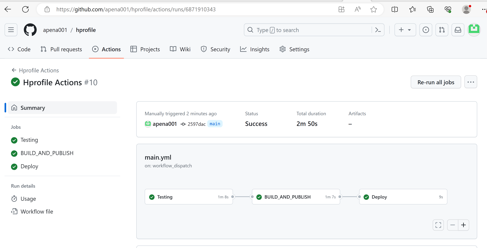

### To automatically push the workflow we add push to the second line as follows

on: [push, workflow_dispatch]

This will automatically push our job into the work flow 

The end
